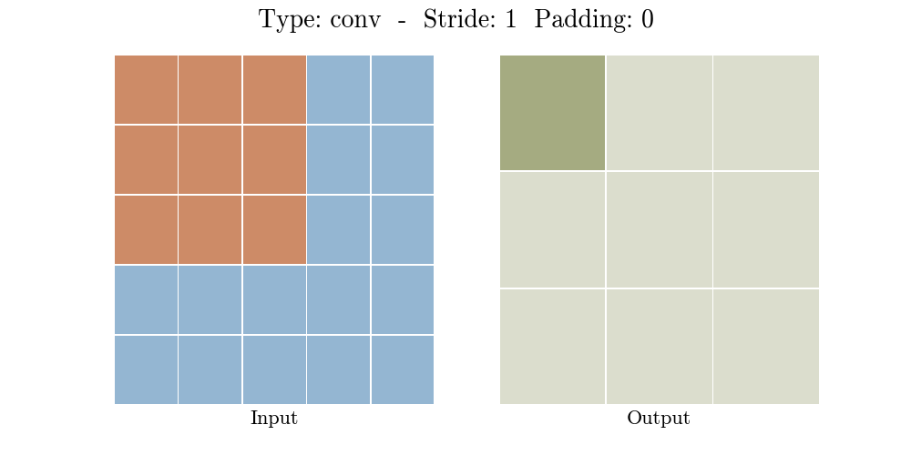
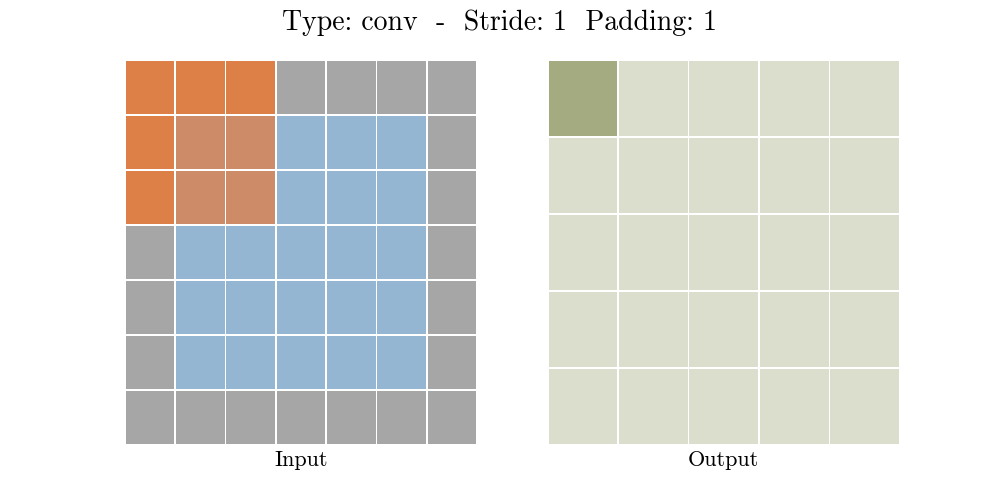
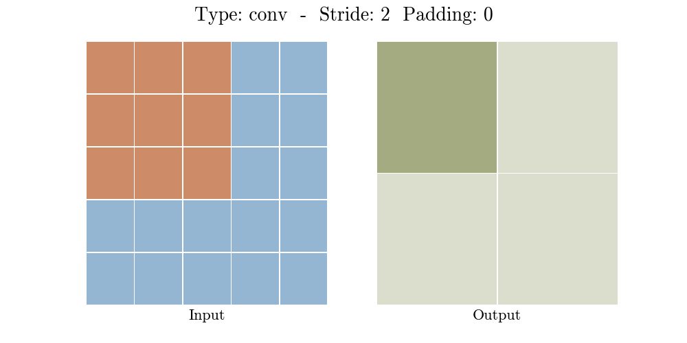
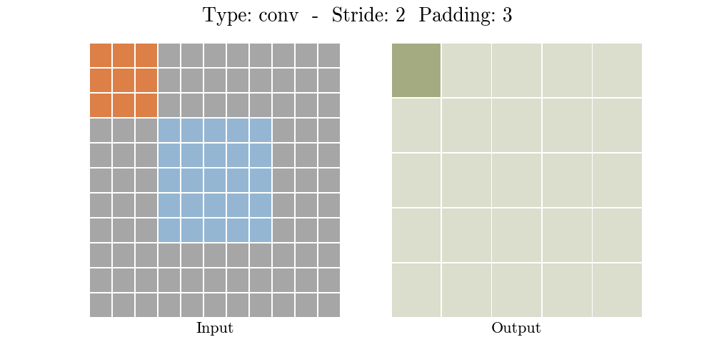
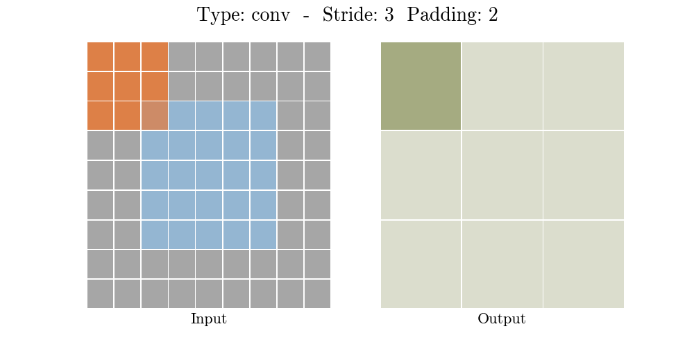
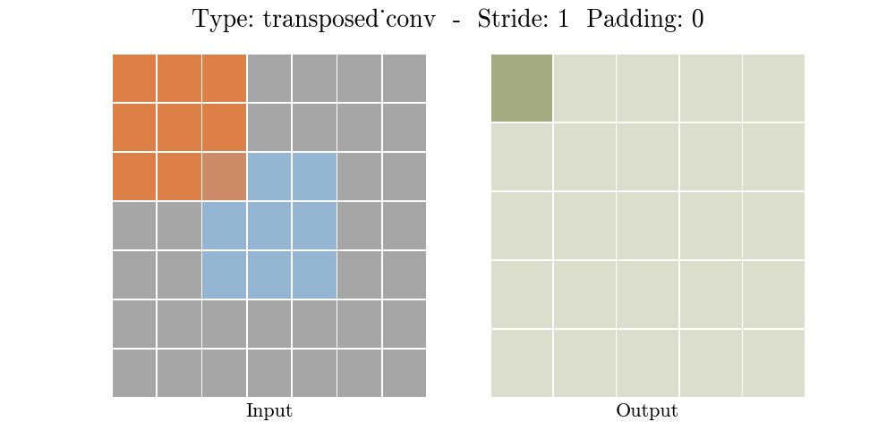
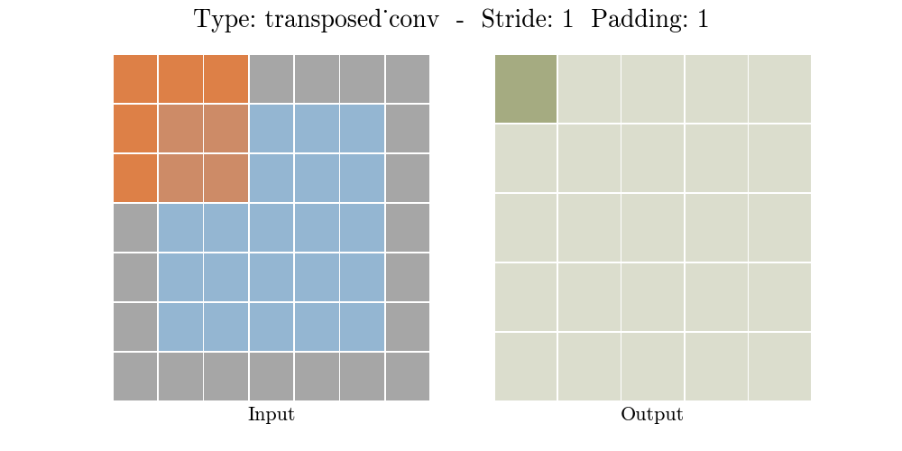
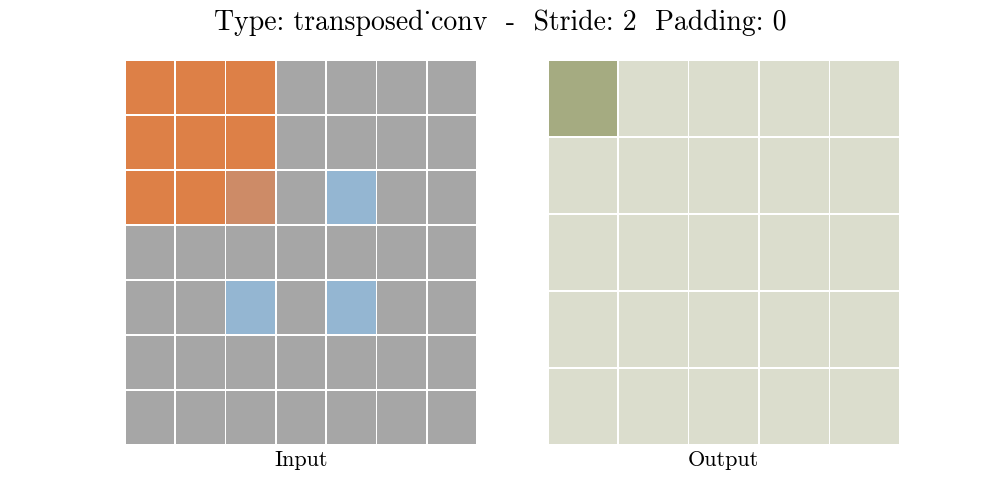
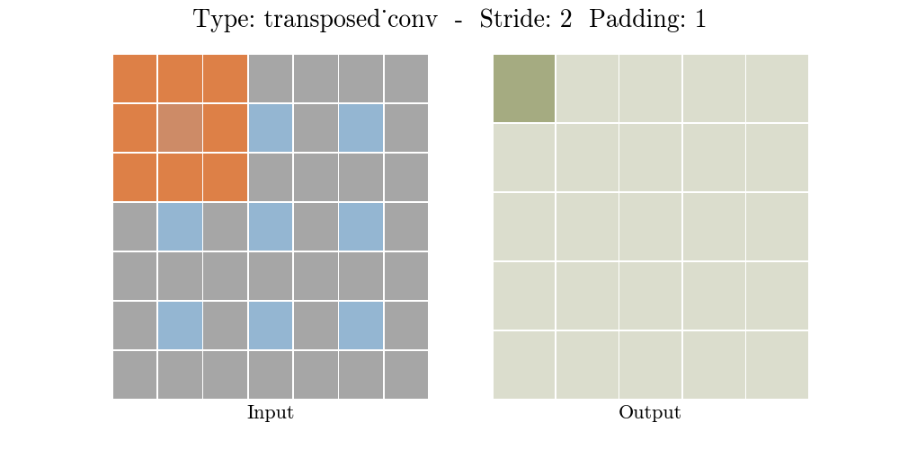

# Animation for Convolutional layers
## Input Parameters:
```
input_sz:     Size of the input feature map
kernel_sz =   Size of the kernel/filter
stride =      Stride length
padding_sz =  Amount of zero padding
layer_type =  Either 'conv' for standard convolutional layer or 'transposed_conv' for transposed convolutional layer
duration = Duration (in seconds) between gif frames
```

## Results
### Convolution






### Transposed Convolution




